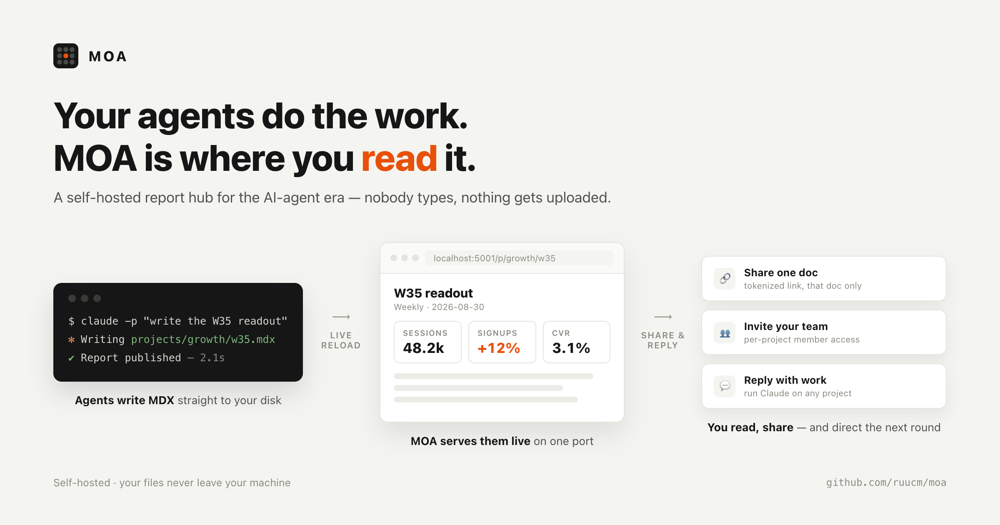
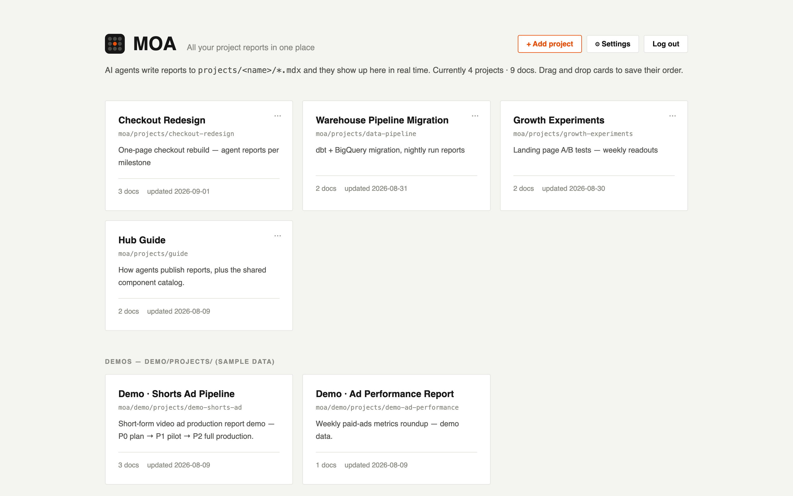
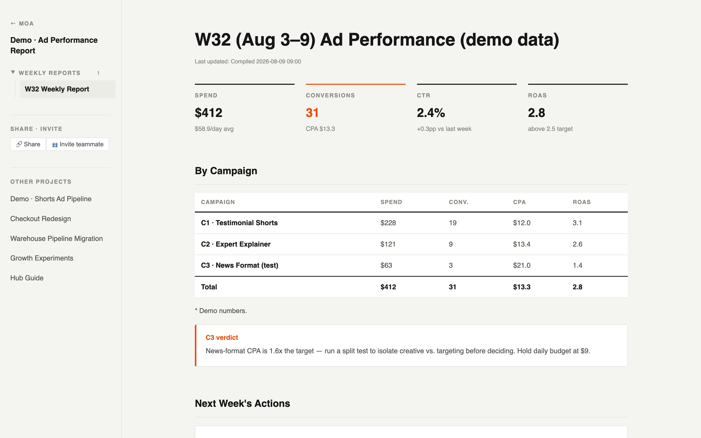

# MOA

**Your agents do the work. MOA is where you read it.**




MOA (모아, Korean for *"gathered"*) is a self-hosted report hub for the AI-agent era.
Coding agents like Claude Code already read and write files on your machine — so instead of
copy-pasting their results into a wiki, let them publish reports directly to disk as MDX.
MOA turns those files into a live, organized, shareable workspace on a single port.

Think of it as a Notion where nobody types: the filesystem is the database, agents are
the authors, and you (and your team) are the readers.

## Why

- **You stop writing status docs.** Agents finish a task and drop a report (`projects/<slug>/report.mdx`). It appears in the hub within seconds — no upload, no sync, no server restart.
- **Your files never leave your machine.** MOA serves folders that already exist — register any project folder and it's symlinked in, originals untouched.
- **Reports are real documents.** MDX with charts-grade built-in components (stats, tables, timelines, checklists, media grids), local component imports, and images/video.
- **Reading is a team sport.** Password-protected by default, with team accounts, per-project invites, and single-document share links for people outside the team.
- **The loop closes in the browser.** Open a Claude chat on any project from the hub and direct the next round of work — the server runs `claude` headlessly and streams the session live.

## What it looks like

The home hub — every project your agents report on, as drag-sortable cards:



A report — plain MDX on disk, rendered with the built-in components (stats, tables, callouts, timelines…):



## Quickstart

```bash
git clone https://github.com/ruucm/moa.git && cd moa
npm install
npm run set-password -- <your-password>   # writes .env.local (hash + cookie secret)
npm run dev                                # → http://localhost:5001
```

Log in with the password (leave email empty). For a strictly local, single-user setup you
can skip auth entirely: `MOA_NO_AUTH=1 npm run dev`.

On macOS you can also double-click `start-moa.command` in Finder — it frees port 5001,
starts the dev server, and opens the browser.

Two demo projects ship with the repo so the home screen isn't empty, plus a **Guide**
project documenting every built-in component (open `/p/guide/components`).

## Publishing a report (the agent contract)

This is the whole API for authors — human or agent:

1. Make a project: `projects/<slug>/_meta.json`
   ```json
   { "title": "My Project", "description": "One-liner", "status": "active", "order": 10 }
   ```
2. Drop a doc: `projects/<slug>/anything.mdx`
   ```mdx
   export const title = 'Week 1 results'
   export const group = 'Weekly'
   export const order = 1
   export const date = '2026-09-01'

   <Stats items={[{ label: 'Done', value: '12', accent: true }]} />
   ```
3. Media goes in `public/<slug>/` and is referenced as `/<slug>/file.png`.

Open browsers refresh automatically (SSE file watching). Built-in components need no
imports: `Stats` `DataTable` `Checks` `Issues` `Timeline` `Progress` `Callout` `Badge`
`Lessons` `Rules` `MediaGrid` `Updated` `FooterNote`.

**Point your agent at [`AGENTS.md`](AGENTS.md)** — it documents all of this plus the HTTP
API. The repo also ships ready-made skills in [`.agents/skills/`](.agents/skills)
(`moa-add-page`, `moa-add-project`) that Claude Code picks up automatically.

Working on projects that live elsewhere? Register any folder from the ⚙ settings UI (or
`POST /api/add`) — MOA symlinks it into `projects/` and its top-level `.mdx` files join
the hub.

## Sharing and teams

- **🔗 Share** on any doc copies a tokenized URL (`/s/<token>`). The recipient sees that
  one document only — the server scopes their access to it and its media, nothing else.
- **Team accounts**: invite links (7-day, single-use) create member accounts scoped to
  specific projects. Admins see everything; members see only what they're invited to.
- Revoke shares and manage members anytime from ⚙ settings.

## Claude chat from the browser

Each project's sidebar has **💬 Claude chat**: the server spawns
`claude -p … --output-format stream-json` in the project root and streams text, tool
calls, and results into a chat panel. Sessions survive reloads, can be resumed, and
terminal-started sessions show up in the history picker too. No API key needed — it uses
your local `claude` login. (Admin-only, and file edits are auto-approved while Bash
requires the explicit "auto-approve" toggle.)

## Configuration

All optional — see [`.env.example`](.env.example):

| Variable | Purpose |
| --- | --- |
| `MOA_PASSWORD_HASH` / `MOA_SECRET` | Owner login + cookie signing (use `npm run set-password`) |
| `MOA_NO_AUTH=1` | Disable auth (local-only use) |
| `MOA_CONTENT_ROOT` | Serve content from outside the checkout |
| `MOA_BROWSE_ROOT` | Root the folder browser is confined to (default: `$HOME`) |
| `MOA_PUBLIC_ORIGIN` | Origin for OG tags on share links (link previews behind port-forwarding) |
| `MOA_PROXIES` | Same-origin proxies to other local dev servers (`name:port,…`) |

For exposure beyond localhost, prefer the production build: `npm run build && npm start`.

## Status

Early but daily-driven — this runs the author's own agent workflows. macOS is the primary
target (the Claude chat, session history, and the Finder launcher assume it); the core
viewer should run anywhere Node 18+ and Next.js do. Issues and PRs welcome.

## License

[MIT](LICENSE)
